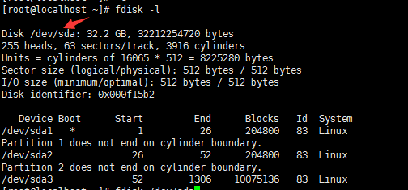
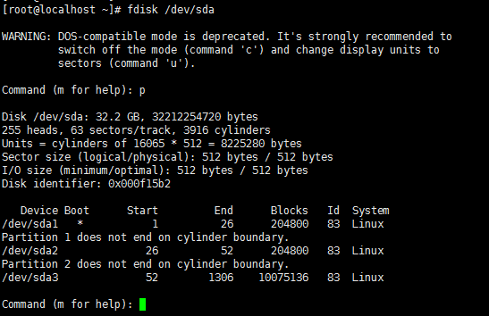
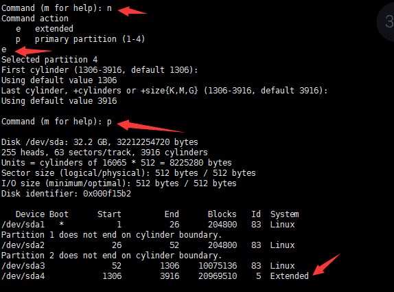
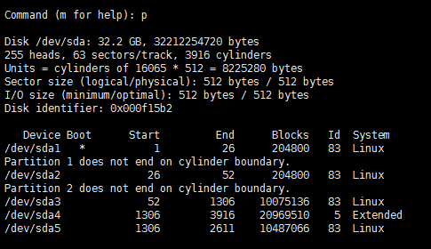
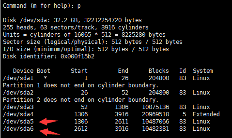
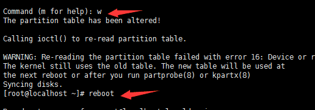
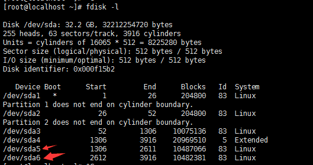
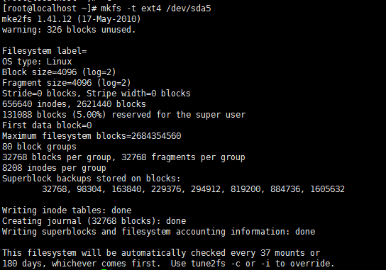
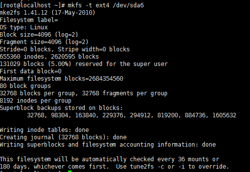
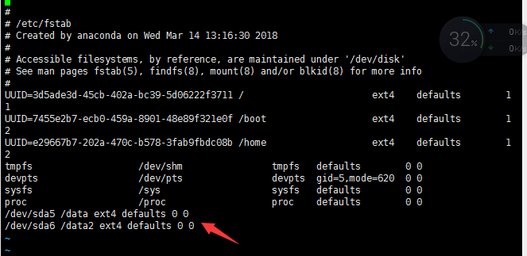

# Linux-新建扩展分区

```bash
# fdisk -l
```



要进行新建扩展分区的磁盘是 /dev/sda
```bash
# fdisk /dev/sda
# p  打印分区表
```



此时磁盘已经有了3个分区，如果要再弄2个分区就不行，这个时候我们进行新建扩展分区
```bash
# n  添加一个新的分区
# e  添加一个扩展分区
# p  打印分区表
```



此时已经看见扩展分区创建完成，在扩展分区下面新建2个分区
因为现在扩展分区是20G  所以下面的2个分区都给10G
```bash
# n
# +10G
# p
```




重复上面的操作
```bash
# n
# 回车
# 回车   此时回车等于把磁盘剩下的所有空间给了此分区
# p
```




创建完毕  保存并重启
```bash
# w
# reboot
```



重新登入系统
```bash
# fdisk -l
```



需要格式化 /dev/sda5   /dev/sda6 分区

```bash
--- ext4是磁盘文件系统的格式，也可以是ext3
# mkfs -t ext4 /dev/sda5
# mkfs -t ext4 /dev/sda6
```





```bash
# mount /dev/sda5 /data
报错:mount: mount point /data does not exist
原因是根目录没有此文件夹
创建文件夹
# mkdir /data
# mkdir /data2
# mount /dev/sda5 /data   把分区 /dev/sda5 挂载到 /data 目录下
# mount /dev/sda6 /data2  把分区 /dev/sda6 挂载到 /data2 目录下
# df -hT  查看是否挂载成功
```


分区格式类型是ext4 分区大小也是10G
##### 此时注意，这样机器重启后就重置了，如果需要永久生效需要设置开机自动挂载（磁盘）

##### 开机自动挂载（磁盘）
```bash
# vi /etc/fstab
--- 最后面添加
/dev/sda5 /data ext4 defaults 0 0
/dev/sda6 /data2 ext4 defaults 0 0
```



### Tips:

###### 第一列：分区的UUID或分区名 例如:/dev/sda5
###### 第二列：Mount point：设备的挂载点，就是你要挂载到哪个目录下。
###### 第三列：filesystem：磁盘文件系统的格式，包括ext2、ext3、reiserfs、nfs、vfat等
###### 第四列：parameters：文件系统的参数
- `Async/sync` 设置是否为同步方式运行，默认为async
- `auto/noauto` 当下载mount -a 的命令时，此文件系统是否被主动挂载。默认为auto
- `rw/ro` 是否以以只读或者读写模式挂载
- `exec/noexec` 限制此文件系统内是否能够进行"执行"的操作
- `user/nouser` 是否允许用户使用mount命令挂载
- `suid/nosuid` 是否允许SUID的存在
- `Usrquota` 启动文件系统支持磁盘配额模式
- `Grpquota` 启动文件系统对群组磁盘配额模式的支持
- `Defaults` 同事具有rw,suid,dev,exec,auto,nouser,async等默认参数的设置

###### 第五列：能否被dump备份命令作用：dump是一个用来作为备份的命令。通常这个参数的值为0或者1
- 0    代表不要做dump备份
- 1    代表要每天进行dump的操作
- 2    代表不定日期的进行dump操作

###### 第六列：是否检验扇区：开机的过程中，系统默认会以fsck检验我们系统是否为完整（clean）。
- 0    不要检验
- 1    最早检验（一般根目录会选择）
- 2    1级别检验完成之后进行检验


#### Tips:
```bash
查看各个分区的UUID和磁盘文件系统的格式
# blkid
```

