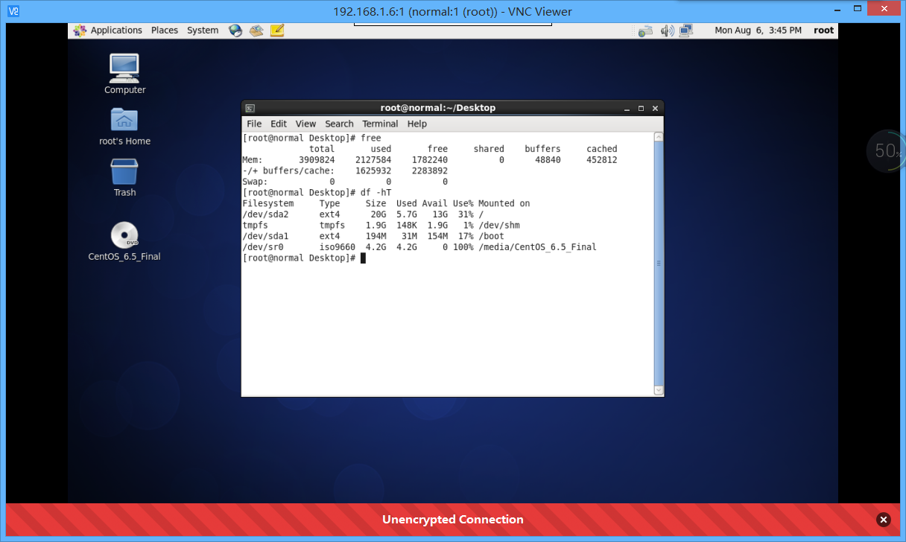

# CentOS-6.X-安装VNC-Server实现图形化访问

##### 一、安装gnome图形化桌面
```bash
# yum groupinstall -y "X Window System"
# yum groupinstall -y "Desktop"
# yum groupinstall -y "Chinese Support"
```

##### 二、安装vncserver（vnc是一款优秀的远程控制软件）
```bash
# yum install -y tigervnc-server
```

##### 三、配置vncserver
```bash
# ---配置为开机自启动
# chkconfig --level 345 vncserver on
# ---配置vnc密码
# vncserver
# ---配置为使用gnome桌面
# ---修改文件xstratup
# vim /root/.vnc/xstartup   把最后的 twm & 删掉 加上 gnome-session &
# ---配置vncserver启动后监听端口和环境参数
# vim /etc/sysconfig/vncservers
# ---在文件末添加以下内容
VNCSERVERS="1:root"
VNCSERVERARGS[1]="-geometry 1200x800"
# ---重启vncserver服务
# service vncserver restart
```
##### 四、允许root访问图形界面和生成新的machine-id
```bash
# sed -i 's/.*!= root.*/#&/' /etc/pam.d/gdm
# dbus-uuidgen > /var/lib/dbus/machine-id
```
##### 五、关闭selinux和NetworkManager服务
###### 1.检查selinux服务并关闭(确认里面的SELINUX字段的值是disabled，如果不是则改为disabled)
```bash
# vim /etc/selinux/config
```
###### 2.关闭NetworkManager服务
```bash
# chkconfig --del NetworkManager
```
安装vncviewer客户端输入IP:1 输入密码访问即可
