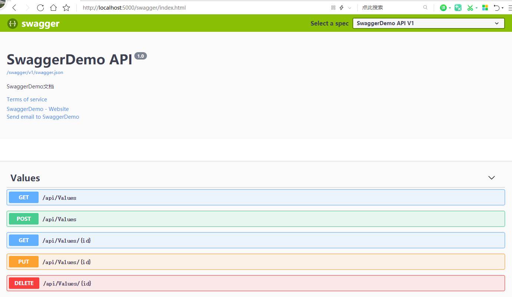


### 1、NuGet引用
```
Swashbuckle.AspNetCore
```
### 2、Startup类中ConfigureServices函数添加代码
```
#region Swagger
public void ConfigureServices(IServiceCollection services)
{
    services.AddMvc().SetCompatibilityVersion(CompatibilityVersion.Version_2_2);

    #region Swagger
    services.AddSwaggerGen(c =>
    {
        c.SwaggerDoc("v1", new Swashbuckle.AspNetCore.Swagger.Info
        {
            Version = "1.0",
            Title = "SwaggerDemo API",
            Description = "SwaggerDemo文档",
            TermsOfService = "None",
            Contact = new Swashbuckle.AspNetCore.Swagger.Contact { Name = "SwaggerDemo", Email = "raikay@163.com", Url = "http://www.raikay.com/" }
        });
    });
    #endregion
}
#endregion
```
### 3、编辑Configure类
```
public void Configure(IApplicationBuilder app, IHostingEnvironment env)
{
    if (env.IsDevelopment())
    {
        app.UseDeveloperExceptionPage();
    }
    #region Swagger
    app.UseSwagger();
    app.UseSwaggerUI(c =>
    {
        c.SwaggerEndpoint("/swagger/v1/swagger.json", "SwaggerDemo API V1");
    });
    #endregion
    app.UseMvc();
}
```
### 4、查看效果
访问网址 `http://localhost:5000/swagger/index.html`  
  

